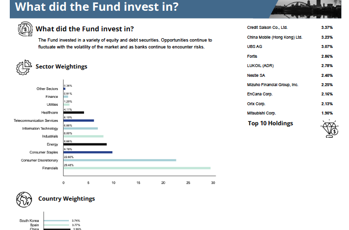
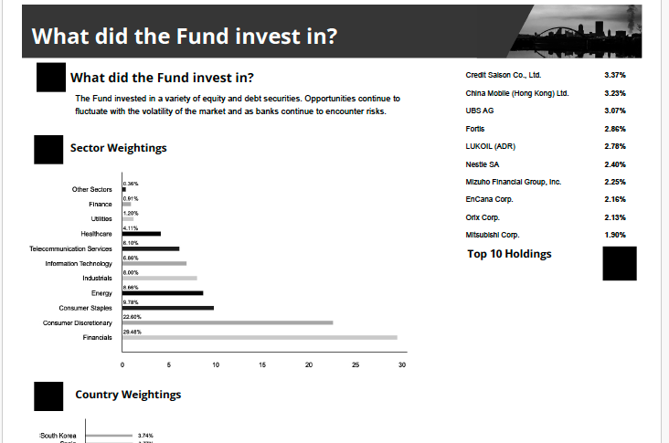
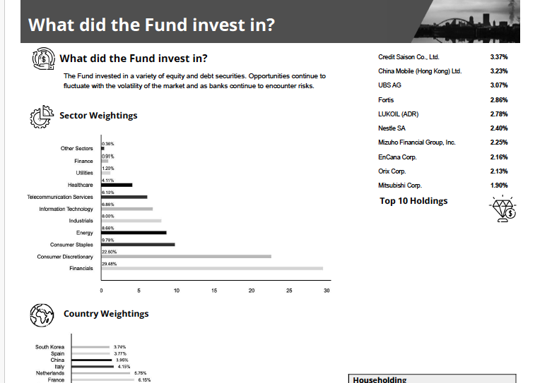

The issue I'm seeing is that when I try to first convert a PDF document to PDF/A, then convert the colors to any other color profile, there are a number of images that
are rendered as completely black.

This is what the PDF looks like before converting

This is what the PDF looks like after converting to PDF/A and then converting the colors (any color profile will have the same result on the affected images)

This is what the PDF looks like if I color convert before converting to PDF/A

